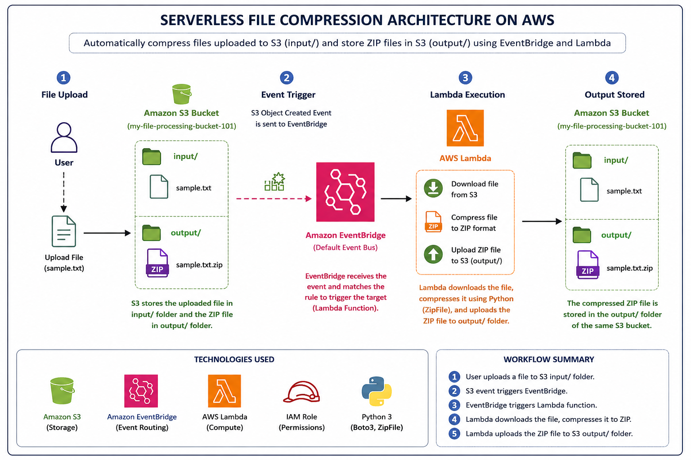
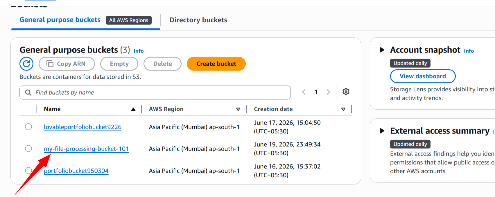
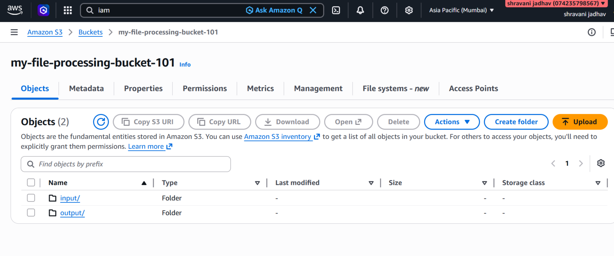
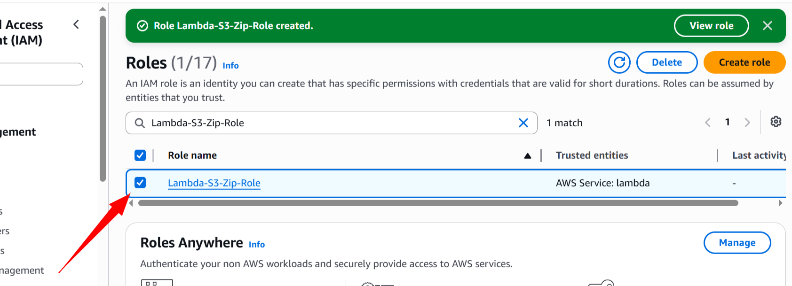
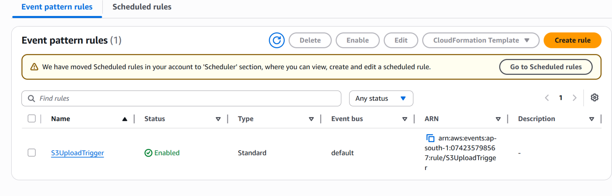
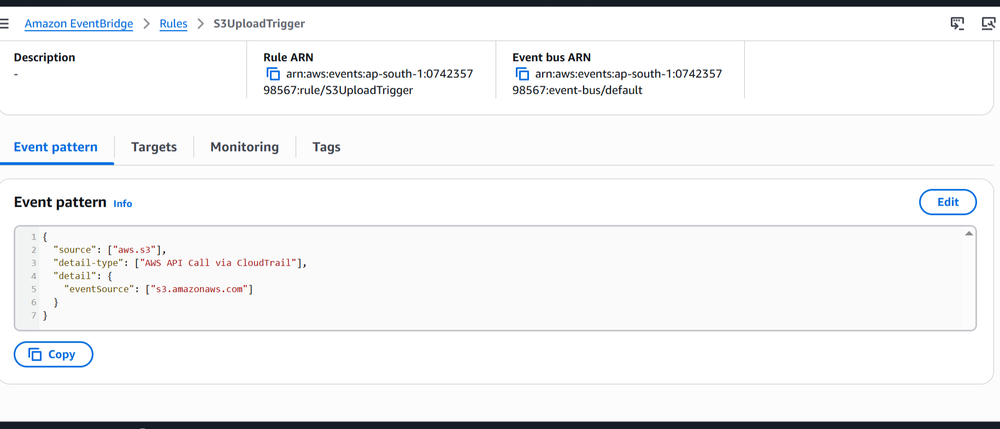
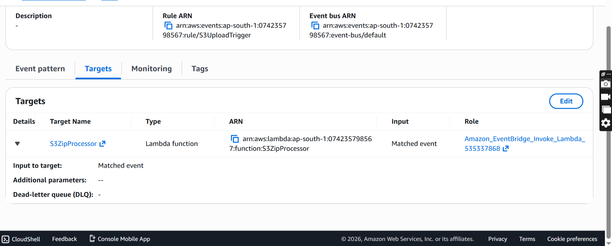
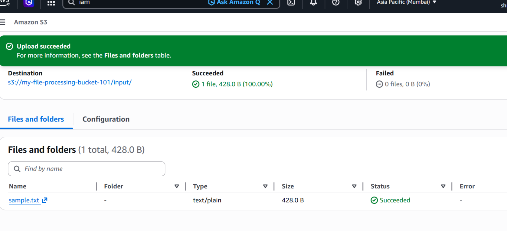
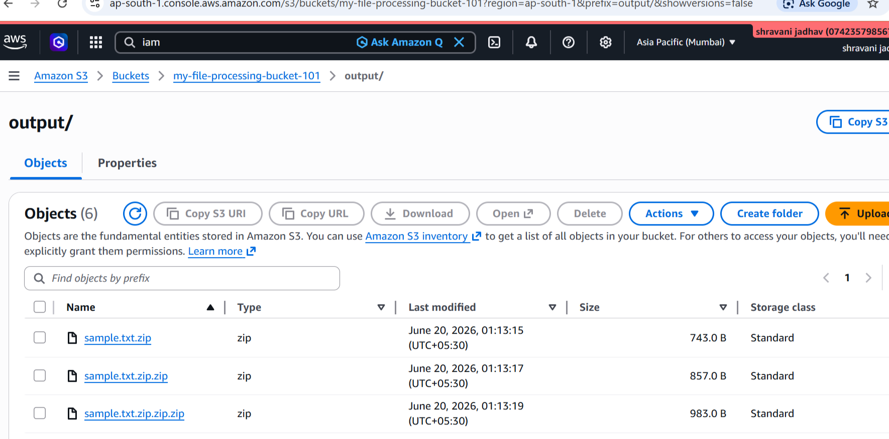

# AWS Serverless File Compression Using S3, EventBridge, Lambda & Python

# INTRODUCTION
This project demonstrates an event-driven serverless architecture on AWS. Whenever a file is uploaded to the input/ folder of an Amazon S3 bucket, Amazon EventBridge automatically triggers an AWS Lambda function. The Lambda function downloads the file, compresses it into ZIP format using Python, and uploads the compressed file back to the output/ folder in the same S3 bucket.
# Architecture Diagram

# AWS Services Used
* Amazon S3
* AWS Lambda
* Amazon EventBridge
* AWS IAM
* Amazon CloudWatch
* Python 
# Project Workflow
1.Create an Amazon S3 bucket.<br>
2.Create input/ and output/ folders inside the bucket.<br>
3.Upload a file to the input/ folder.<br>
4.Amazon EventBridge detects the object creation event.<br>
5.EventBridge triggers the AWS Lambda function.<br>
6.Lambda downloads the uploaded file.<br>
7.Python compresses the file into ZIP format.<br>
8.Lambda uploads the ZIP file to the output/ folder.<br>
9.The compressed file becomes available for download.<br>
# Step-by-Step Implementation
## Step 1: Create S3 Bucket
* Open AWS Console
* Navigate to Amazon S3
* Create a new bucket

* Create two folders:
     * input/
     * output/

 
## Step 2: Create Lambda Function
* Navigate to AWS Lambda
* Click Create Function
* Function Name: S3ZipProcessor
* Runtime: Python 3.12
* Create the function
## Step 3: Configure IAM Permissions

Attach the following policies to the Lambda execution role:<br>

* AmazonS3FullAccess
* AWSLambdaBasicExecutionRole
## Step 4: Add Python Code

Upload the Lambda code that:<br>
```bash
import boto3
import zipfile
import os

s3 = boto3.client('s3')

def lambda_handler(event, context):

    bucket = event['detail']['bucket']['name']
    key = event['detail']['object']['key']

    file_name = key.split('/')[-1]

    download_path = f"/tmp/{file_name}"
    zip_path = f"/tmp/{file_name}.zip"

    # Download file from S3
    s3.download_file(bucket, key, download_path)

    # Create ZIP
    with zipfile.ZipFile(zip_path, 'w', zipfile.ZIP_DEFLATED) as zipf:
        zipf.write(download_path, file_name)

    # Upload ZIP back to S3
    s3.upload_file(
        zip_path,
        bucket,
        f"output/{file_name}.zip"
    )

    return {
        'statusCode': 200,
        'body': 'ZIP created successfully'
    }
```

* Downloads files from S3
* Compresses them using ZipFile
* Uploads ZIP files back to S3
## Step 5: Increase Lambda Timeout
```bash
Timeout = 1 Minute

Memory = 512 MB
```
## Step 6: Enable EventBridge on S3 Bucket
* Open S3 Bucket
* Go to Properties
* Locate Amazon EventBridge
* Enable EventBridge notifications
## Step 6: Create EventBridge Rule
* Open Amazon EventBridge
* Create Rule

* Event Source: Amazon S3
* Event Type: Object Created

* Target: AWS Lambda Function (S3ZipProcessor)

## Step 7: Test the Project

Upload:<br>

input/sample.txt<br>

Expected Output:<br>

output/sample.txt.zip<br>
## Sample Test Event
```bash
{
  "detail": {
    "bucket": {
      "name": "my-file-processing-bucket-101"
    },
    "object": {
      "key": "input/sample.txt"
    }
  }
}
```
## Key Learnings
* Event-Driven Architecture
* Serverless Computing
* AWS Lambda Automation
* Amazon S3 Operations
* EventBridge Event Routing
* IAM Roles & Permissions
* Python Automation with Boto3
* File Processing and Compression
## Project Outcome

Successfully built a serverless file compression solution that automatically compresses files uploaded to Amazon S3 and stores the compressed ZIP files back in S3 using AWS Lambda and EventBridge.
## Future Enhancements
* Process multiple file formats
* Add email notifications using Amazon SNS
* Store logs in CloudWatch Dashboard
* Automate cleanup of old ZIP files
* Integrate with AWS Step Functions
## Author

Shravani Jadhav

## Special Thanks

Special thanks to my mentor Trupti Ma'am for her valuable guidance, support, and mentorship throughout the project.